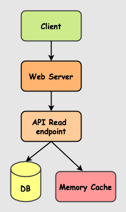
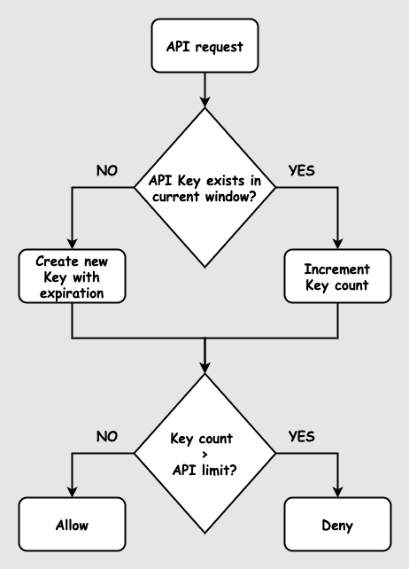

# RatesDB
A free foreign exchange rates JSON API with currency conversion. The API uses the exchange rates published by European Central Bank.

## Architecture
The architecture is pretty simple. The client requests are routed to a web server. The web server proxies it to a Go application. The Go app fetches the exchange rate data from Redis if it's available. If the data is missing, the app fetches it from the DB & stores it in Redis. The exchange rate information is then made available to the client.



## Technical information

The app uses a _Fixed window counter_ for API rate limiting.

### Why do we need to Rate limit an API?
* Avoid any DDOS attacks
* Avoid resources being exploited
* Reduces cost of the infrastructure

### Fixed window counter
If the API request is valid, a key is generated using the IP address of the API request.
The KEY format used in the application is `api_user:IP-address:minute`.

There are two ways to proceed:
1. If the key exists, the key count is increased. The equivalent Redis command:
```
INCR api_user:IP-address:minute
```

2. If the key doesn't exist, a key is registered in Redis with its count value as 1. An expiry timeout is also added. The equivalent Redis commands are:
```
INCR api_user:IP-address:minute
EXPIRE api_user:IP-address:minute <remaining-seconds-of-the-current-minute-window>
```
The `INCR` command will create a key and set its value as 1.

3. The key value is compared with the API rate limit.
   * If the value is greater than the API rate limit, a _HTTP 429: Too many requests_ response is provided.
   * If the value is lower or equal to the API rate limit, the request is further processed.

The flowchart for the above steps:



The above architectural approach will be able to handle API rate limit requests for second based windows too. Redis is pretty fast and responds in nano seconds. However, you would need to replace the window-counters.

### Datastore
The permanent datastore is MariaDB. A cron job is run which populates the daily exchange rates published by the European Central Bank.

### Redis
Redis is a fast, in-memory key-value store. It holds the latest 30 day exchange rates as Hashes.

### Go
The programming language used to write the web application.

### Future considerations
Leverage Serverless framework for an enterprise level API application with cross region replication. Preference is to use the following AWS products: API Gateway, Lambda, DynamoDB.
